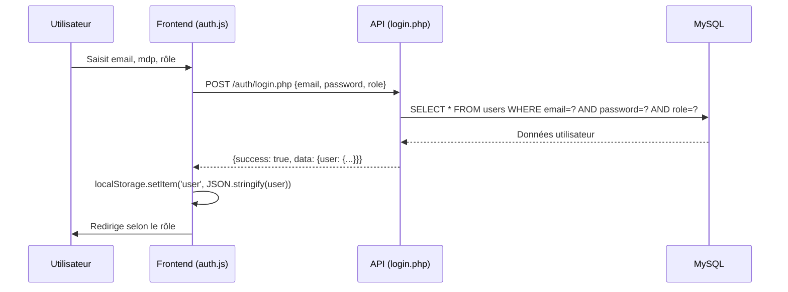
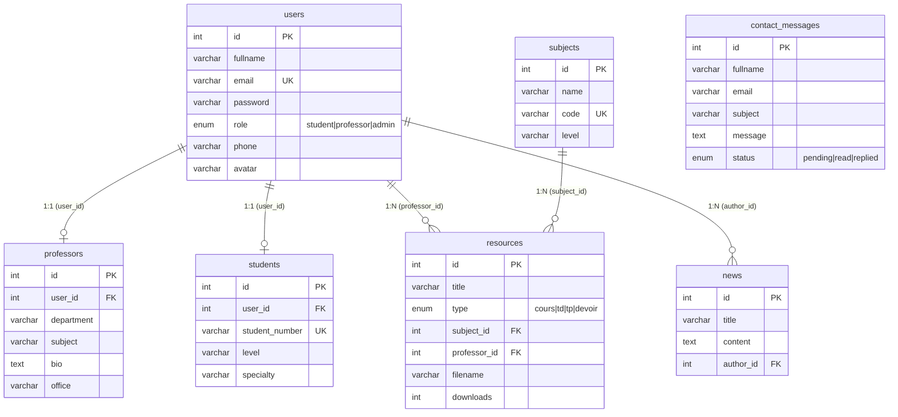
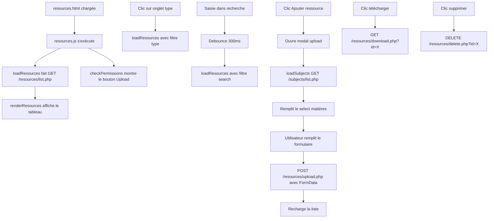

# 🎓 Comprendre le Site — Plateforme Académique ENSI

## Objectif du Projet

C'est une **plateforme web académique** pour l'**École Nationale des Sciences de l'Informatique (ENSI)** de Tunisie. Elle permet de :
- Gérer les **utilisateurs** (étudiants, professeurs, admin)
- Partager des **ressources pédagogiques** (cours, TD, TP, devoirs)
- Consulter l'**annuaire** des professeurs et étudiants
- **Contacter** l'administration

---

## Architecture Globale

```mermaid
graph TB
    subgraph "🖥️ Frontend (HTML/CSS/JS)"
        A[index.html<br/>Page d'accueil]
        B[login.html<br/>Connexion]
        C[register.html<br/>Inscription]
        D[professors.html<br/>Liste profs]
        E[students.html<br/>Liste étudiants]
        F[resources.html<br/>Cours & Devoirs]
        G[about.html<br/>À propos]
        H[contact.html<br/>Contact]
    end

    subgraph "📦 JavaScript"
        J1[main.js<br/>Menu & animations]
        J2[api.js<br/>Client API + Auth]
        J3[auth.js<br/>Formulaire login]
        J4[resources.js<br/>Gestion ressources]
    end

    subgraph "⚙️ Backend PHP (API REST)"
        API_AUTH[/auth/<br/>login.php, register.php]
        API_PROF[/professors/<br/>list, add, delete]
        API_STU[/students/<br/>list, add, delete]
        API_RES[/resources/<br/>list, upload, download, delete]
        API_SUB[/subjects/<br/>list]
        API_CON[/contact/<br/>send]
        API_STAT[/status/<br/>dashboard]
    end

    subgraph "🗄️ Base de Données MySQL"
        DB[(ensi_db)]
    end

    A & B & C & D & E & F & G & H --> J1 & J2
    B --> J3
    F --> J4
    J2 -->|fetch HTTP| API_AUTH & API_PROF & API_STU & API_RES & API_SUB & API_CON & API_STAT
    API_AUTH & API_PROF & API_STU & API_RES & API_SUB & API_CON & API_STAT --> DB
```

---

## Structure des Fichiers

| Chemin | Rôle |
|--------|------|
| `index.html` | Page d'accueil — Hero, stats, cartes des espaces |
| `login.html` | Formulaire de connexion (email + mdp + rôle) |
| `register.html` | Formulaire d'inscription |
| `professors.html` | Annuaire interactif des professeurs |
| `students.html` | Liste des étudiants |
| `resources.html` | Centre de téléchargement des ressources + upload |
| `about.html` | Page "À propos" de l'ENSI |
| `contact.html` | Formulaire de contact |
| `css/style.css` | Feuille de style unique (design glassmorphism, responsive) |
| `js/main.js` | Menu hamburger, animations compteurs, lien actif |
| `js/api.js` | **Classe `API`** (client HTTP) + objet **`Auth`** (localStorage) |
| `js/auth.js` | Logique du formulaire de login |
| `js/resources.js` | Chargement, filtrage, recherche et upload de ressources |

---

## 🔑 Système d'Authentification

Le système est **simplifié** (pas de JWT ni de hash de mot de passe) :



**Redirection après login :**
| Rôle | Page de destination |
|------|-------------------|
| `admin` | `index.html` |
| `professor` | `resources.html` |
| `student` | `students.html` |

L'objet `Auth` dans [api.js](file:///home/oussama/Bureau/projet_web/js/api.js#L126-L164) gère tout via **localStorage** :
- `Auth.isLoggedIn()` → vérifie si un user est stocké
- `Auth.getUser()` → retourne l'utilisateur courant
- `Auth.getRole()` → retourne le rôle
- `Auth.logout()` → supprime et redirige vers login

> [!IMPORTANT]
> Les mots de passe sont stockés **en clair** dans la DB (pas de bcrypt/hash). C'est un choix de simplification pour le projet scolaire.

---

## 🗄️ Base de Données

7 tables dans `ensi_db` :



---

## ⚙️ Backend — Endpoints API

Tous les endpoints retournent du **JSON** avec la structure :
```json
{ "success": true/false, "message": "...", "data": {...} }
```

| Endpoint | Méthode | Description |
|----------|---------|-------------|
| `/auth/login.php` | POST | Connexion (email, password, role) |
| `/auth/register.php` | POST | Inscription d'un nouvel utilisateur |
| `/professors/list.php` | GET | Liste des professeurs (avec filtres) |
| `/professors/add.php` | POST | Ajouter un professeur |
| `/professors/delete.php` | DELETE | Supprimer un professeur |
| `/students/list.php` | GET | Liste des étudiants (avec filtres) |
| `/resources/list.php` | GET | Liste des ressources (filtres: type, search) |
| `/resources/upload.php` | POST | Upload d'un fichier (FormData) |
| `/resources/download.php` | GET | Télécharger un fichier |
| `/resources/delete.php` | DELETE | Supprimer une ressource |
| `/subjects/list.php` | GET | Liste des matières |
| `/contact/send.php` | POST | Envoyer un message de contact |
| `/status/dashboard.php` | GET | Statistiques du dashboard |

### Configuration Backend

- [database.php](file:///home/oussama/Bureau/projet_web/backend/config/database.php) — Connexion PDO à MySQL (`root@localhost`, DB `ensi_db`)
- [config.php](file:///home/oussama/Bureau/projet_web/backend/config/config.php) — Constantes (URL, upload max 20MB, extensions autorisées)
- [helpers.php](file:///home/oussama/Bureau/projet_web/backend/includes/helpers.php) — Fonctions utilitaires (réponse JSON, validation, sanitization)
- [cors.php](file:///home/oussama/Bureau/projet_web/backend/includes/cors.php) — Headers CORS pour les requêtes cross-origin

---

## 📄 Flux de la Page Ressources (exemple complet)

C'est la page la plus riche fonctionnellement. Voici comment elle fonctionne :



---

## 🎨 Design & CSS

Le site utilise un design moderne avec :
- **Police** : Poppins (Google Fonts)
- **Icônes** : FontAwesome 6
- **Style** : Glassmorphism, gradients, ombres douces
- **Responsive** : Menu hamburger sur mobile
- **Variables CSS** : `--primary`, `--dark`, `--light-gray`, `--danger`, `--radius`, etc.
- **Composants** : navbar, hero, cards, tables, modals, forms, footer unifié

---

## 🔐 Données de Test

| Rôle | Email | Mot de passe |
|------|-------|-------------|
| Admin | `admin@ensi.tn` | `admin` |
| Professeur | `a.benali@ensi.tn` | `1234` |
| Étudiant | `a.khouaja@ensi.tn` | `1234` |

---

## ⚠️ Points à Noter

> [!WARNING]
> **Sécurité simplifiée** — Les mots de passe sont en clair, pas de JWT, l'authentification repose uniquement sur localStorage. C'est adapté pour un projet scolaire mais pas pour la production.

> [!NOTE]
> **API Students** — Les fichiers dans `backend/api/students/` sont quasi vides (~30 octets chacun), ils ne sont pas encore implémentés.

> [!NOTE]
> **Base URL** — Le frontend s'attend à ce que le backend soit à `http://localhost/ensi_website/backend/api`. Le projet doit être placé dans `htdocs/ensi_website/` pour fonctionner.
